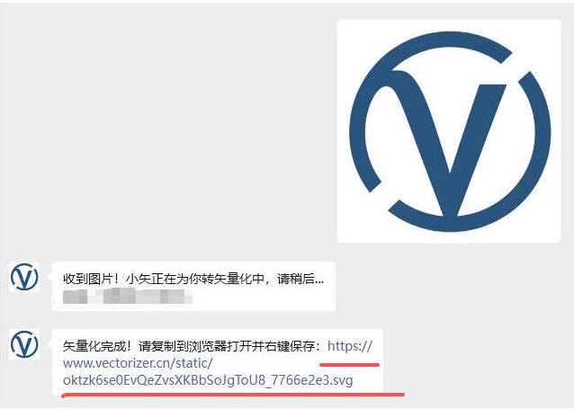
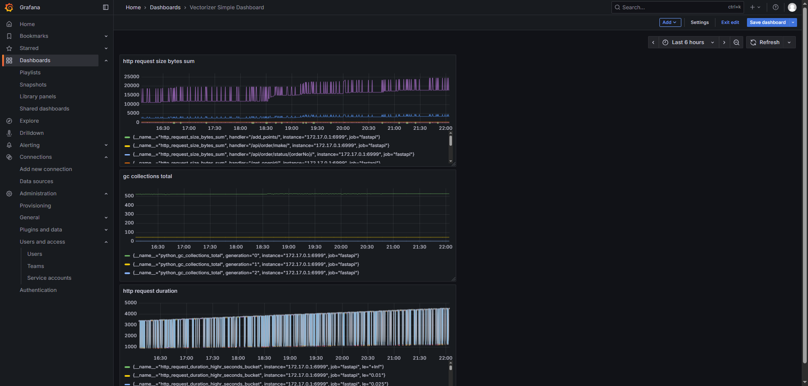

# BitmapToVector AI: Intelligent Image Conversion Platform

A sophisticated vector conversion system built with **FastAPI + Celery + Redis + SQLite + RESTful APIs + LLM + Prometheus**, delivering seamless bitmap-to-vector transformation through WeChat service account integration. Currently serving **2700+ active users** (until 09/12/2025).

## 👋 Screenshot



## 👨‍💻 About the Developer

Hi, I'm **Tobias Chen**, a Python/Django developer specializing in building scalable, production-ready web applications.
My expertise spans **backend engineering, API design, cloud deployments, Machine Learning, and Data Science**. I prioritize **clean architecture, CI/CD automation, and maintainability** - essential qualities for remote-first development teams.

- 🌍 Open to **remote opportunities across Europe/Australia/Asia/North America**
- 💼 Strong experience with **Python, Django, REST APIs, Docker, PostgreSQL**
- ⚙️ Familiar with **async processing, Celery, Redis, and modern CI/CD pipelines, Azure**
- 🎨 Passionate about projects combining **web apps + image processing + automation**
- 🔗 [LinkedIn](https://www.linkedin.com/in/jiawei-chen-4095802a9/) | [GitHub](https://github.com/TobiasChen-ML)
- 📧 tobiaschannel1999@gmail.com

## 🛠️ Core Technology Stack

- **FastAPI**: High-performance asynchronous web framework for building robust APIs
- **AI Vectorizer**: Potrace-based conversion engine with intelligent preprocessing
- **Celery + Redis**: Distributed task management and message brokering
- **Prometheus + Grafana**: Real-time monitoring and alerting infrastructure
- **LangChain**: LLM integration for intelligent user interactions
- **SQLite**: Lightweight database optimized for current scale requirements

## 📊 Live Monitoring Dashboard

Access our comprehensive monitoring system:

- **URL**: https://grafana.vectorizer.cn
- **Username**: guest
- **Password**: vectorDemo2025

Explore real-time system metrics, conversion statistics, and performance analytics.

## 🚀 Roadmap & Future Enhancements

- **Intelligent Chat Assistant**: LangChain integration for contextual user guidance
- **Enhanced Conversion Algorithms**: Machine learning-powered vectorization improvements
- **Containerization**: Full Docker implementation for streamlined deployment
- **CI/CD Pipeline**: Automated testing and deployment workflows
- **Multi-format Support**: Expanded input/output format compatibility
- **User Analytics**: Advanced usage tracking and conversion analytics
- **Cloud Storage Migration**: Transition static assets to S3 bucket instead of local storage

## ⚡ Quick Start

1. **Clone the repository**:
```bash
git clone https://github.com/TobiasChen-ML/Fastapi-vectorizer-backend.git
cd Fastapi-vectorizer-backend
```

2. **Install dependencies**:
```bash
pip install -r requirements.txt
```

3. **Launch the platform**:
```bash
sh restart.sh
```


## 🌐 WeChat Integration

Interact with our service through WeChat official account:
- Search for **"位图转矢量"** (Bitmap to Vector)
- Upload images directly for instant conversion
- Receive vector files in multiple formats

---

*For collaboration opportunities or technical inquiries, please contact me at tobiaschannel1999@gmail.com*